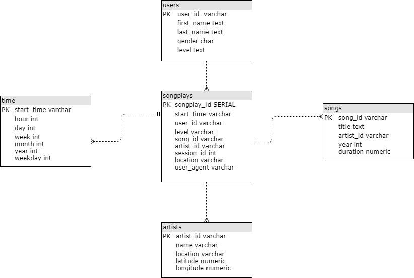

# Data-Modeling-with-Postgres
(Udacity: Data Engineering Nano Degree) | learngvrk@gmail.com | 2019-12-23 This project is a part of Udacity's Data Engineer Nano Degree.

## Project 1 - Data Modeling with Postgres

### Background:
The startup Sparkify was interested to analyze the data collected from the user activity on their music app on the mobile phones.

Based on the user activity the startup would like to perform some analytics to derive insights which will help the organization to better understand the user behavior, and so add more interesting features to their mobile app which would enhance the user experience and stratergize the product development roadmap.

### Database Schema

- The database schema the team has come up with the following **STAR-SCHEMA** which captures all the important dimensions needed to create the fact table.
- Artists, Users, Songs, Time are the most quintessential dimensions needed to build the fact table, which is then used to derive insights.
- **FACT TABLE:** contains the required dimensions to categorize and their measures (build aggregations) to derive facts, which enables analyze the user behavior.

### Create Tables
Created the following **DIMENSION** tables
> 1. Users
> 2. Songs
> 3. Artists
> 4. Time

Created the **FACT** table: 
> Songplays

### Sample Queries which can be used for Analytics
- For a given user what is his favorite songs (most played ones)
- What is the most played songs (Toppers) at a given time of the day or season based on user demographics
- Is there a song which is played across all regions of the country.

### Perform ETL
1. Extract data from songs data JSON file 
